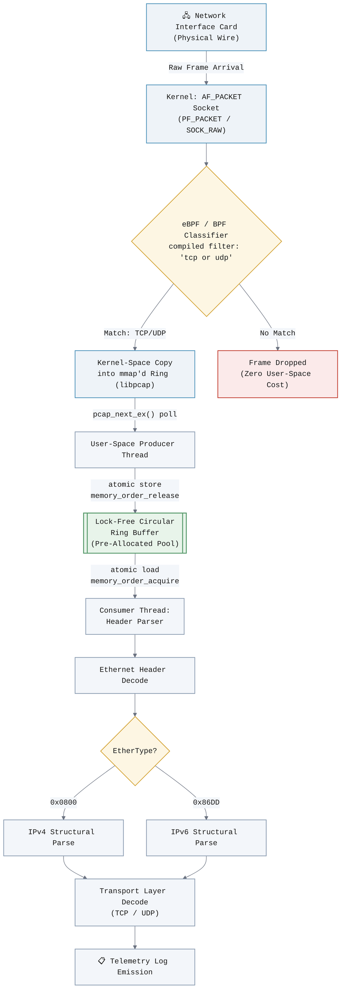

# High-Performance Dual-Stack Network Packet Parser

[](https://isocpp.org/)
[](https://www.tcpdump.org/)
[](#)
[](#license)

A lock-free, zero-allocation packet capture and dissection engine built on `libpcap` and raw Linux kernel primitives. It performs native dual-stack (IPv4/IPv6) header decomposition via direct pointer arithmetic, offloads early traffic filtering to an in-kernel eBPF/BPF classifier, and ingests frames through a wait-free circular ring buffer designed to sustain high-throughput links without dropping frames under producer/consumer contention.

This is not a wrapper around `tcpdump`. It is a from-scratch ingestion pipeline built to reason about memory layout, cache behavior, and concurrency at the level required for line-rate packet processing.

---

## Table of Contents

- [System & Data Pipeline Architecture](#system--data-pipeline-architecture)
- [Diagram 1: Hardware-to-User-Space Flow](#diagram-1-hardware-to-user-space-flow)
- [Diagram 2: Dynamic Memory Offset Architecture](#diagram-2-dynamic-memory-offset-architecture)
- [Core Engineering Features](#core-engineering-features)
- [Getting Started](#getting-started)
- [Sample Telemetry Logs](#sample-telemetry-logs)
- [Design Rationale & Tradeoffs](#design-rationale--tradeoffs)
- [Roadmap](#roadmap)
- [License](#license)

---

## System & Data Pipeline Architecture

The parser is architected around a single governing principle: **minimize the number of copies and allocations between the NIC and the point of interpretation.** Every design decision — the BPF pre-filter, the ring buffer's memory model, and the header-parsing strategy — is downstream of that constraint.

At a high level, the pipeline is split into four stages:

1. **Kernel Capture & Filtering** — `libpcap` opens a live capture handle on the target interface (via `pcap_findalldevs` for safe, enumerated device discovery) and installs a compiled BPF program directly into the kernel's socket filter (`AF_PACKET`/`PF_PACKET` path), so irrelevant traffic (e.g., non-TCP/UDP) is dropped before it ever crosses into user space.
2. **Zero-Copy Ring Ingestion** — Frames that pass the kernel filter are written into a pre-allocated, fixed-capacity circular buffer. No `malloc`/`new` occurs on the hot path. Producer and consumer coordinate via atomic indices with explicit acquire/release semantics rather than mutexes.
3. **Structural Header Decomposition** — A single consumer thread walks each frame using raw pointer offsets and `reinterpret_cast`-based structural overlays to decode Ethernet, IPv4/IPv6, and transport (TCP/UDP) headers in place — no intermediate object graph, no per-packet heap allocation.
4. **Telemetry Emission** — Decoded 5-tuples and protocol metadata are flushed to a structured log sink (stdout in this build; pluggable for syslog/Kafka in future iterations).

---

## Diagram 1: Hardware-to-User-Space Flow

This diagram traces a frame from wire arrival through kernel-space BPF evaluation into the lock-free ring buffer and out to the consumer thread.



**Key property:** the only heap-independent, allocation-free path is `D → E → F → G`. The ring buffer's capacity is fixed at initialization; under sustained overload the producer stalls on backpressure rather than allocating, which is a deliberate tradeoff favoring predictable latency over unbounded buffering.

---

## Diagram 2: Dynamic Memory Offset Architecture

This diagram shows how the parser steps a single `const uint8_t*` cursor through the frame using computed byte offsets and structural overlays — no `memcpy` of header fields, no intermediate structs beyond the overlay itself.

```mermaid
%%{init: {
  "theme": "base",
  "themeVariables": {
    "background": "#ffffff",
    "primaryColor": "#eef3f8",
    "primaryTextColor": "#1a1a1a",
    "primaryBorderColor": "#4a90b8",
    "lineColor": "#6b7280",
    "secondaryColor": "#f3f6fa",
    "tertiaryColor": "#fdf6e3",
    "fontFamily": "Menlo, Consolas, monospace"
  }
}}%%
flowchart LR
    subgraph FRAME["Raw Captured Frame Buffer (const uint8_t*)"]
        direction LR
        A["Ethernet Header<br/>Offset: +0<br/>Size: 14 bytes<br/>struct ether_header"]
        B["IP Header<br/>Offset: +14<br/>IPv4: 20-60 bytes (IHL)<br/>IPv6: fixed 40 bytes"]
        C["Transport Header<br/>Offset: +14+IHL*4<br/>or +14+40<br/>TCP: 20-60B / UDP: 8B"]
        D["Payload<br/>Offset: computed<br/>remaining bytes"]
        A --> B --> C --> D
    end

    E["ptr = packet_buffer"] --> F["Cast to ether_header*<br/>read ether_type"]
    F --> G{"ether_type"}
    G -->|"ETHERTYPE_IP<br/>0x0800"| H["ptr += 14<br/>Cast to ip* (IPv4)<br/>read ip_hl (IHL) & bit-mask"]
    G -->|"ETHERTYPE_IPV6<br/>0x86DD"| I["ptr += 14<br/>Cast to ip6_hdr* (IPv6)<br/>fixed 40B header"]
    H --> J["ptr += (ip_hl * 4)<br/>IHL-derived variable offset"]
    I --> K["ptr += 40<br/>fixed offset, no bit-mask needed"]
    J --> L{"ip_p protocol field"}
    K --> M{"nxt (next header) field"}
    L -->|"IPPROTO_TCP / UDP"| N["Cast to tcphdr* / udphdr*<br/>read ports, flags, seq"]
    M -->|"IPPROTO_TCP / UDP"| N
    N --> O["ptr += transport_header_len<br/>Cursor now at L4 payload"]

    classDef mem fill:#f3f6fa,stroke:#8a9bb0,stroke-width:1.5px,color:#1a1a1a;
    classDef ptr fill:#eef3f8,stroke:#4a90b8,stroke-width:1.5px,color:#1a1a1a;
    classDef decision fill:#fdf6e3,stroke:#d4a437,stroke-width:1.5px,color:#1a1a1a;
    classDef v4 fill:#e8f4ea,stroke:#5b9c6e,stroke-width:1.5px,color:#1a1a1a;
    classDef v6 fill:#eef0fb,stroke:#6b6bc4,stroke-width:1.5px,color:#1a1a1a;

    class A,B,C,D mem;
    class E,F,J,K,N,O ptr;
    class G,L,M decision;
    class H v4;
    class I v6;
```



**Key property:** IPv4's variable-length header (via IHL) requires a runtime-computed offset (`ip_hl * 4`), whereas IPv6's fixed 40-byte header allows a compile-time-known constant stride — the parser branches on EtherType once and then applies the correct offset arithmetic for the remainder of the walk, with zero per-field copying.

---

## Core Engineering Features

| Feature | Implementation Detail |
|---|---|
| **Dual-Stack Header Decoding** | Native IPv4 and IPv6 support via structural bit-masking (`ip_hl & 0x0F`) and pointer arithmetic over `struct ip` / `struct ip6_hdr` overlays — no per-protocol allocation or copy. |
| **Zero-Allocation Ring Buffer** | Fixed-capacity circular buffer backed by a pre-allocated memory pool. Single-producer/single-consumer coordination uses `std::atomic<size_t>` head/tail indices with `std::memory_order_release` on publish and `std::memory_order_acquire` on consume — no locks, no allocation on the steady-state path. |
| **Kernel-Level BPF Filtering** | Filter expressions (e.g., `tcp or udp`) are compiled via `pcap_compile` and installed via `pcap_setfilter`, executing inside the kernel's packet filter VM so non-matching traffic never crosses the kernel/user-space boundary. |
| **RAII Resource Safety** | All `pcap_t*` handles are wrapped in `std::unique_ptr` with a custom deleter bound to `pcap_close`, eliminating manual cleanup paths and double-free/leak hazards. Interface enumeration uses `pcap_findalldevs` with RAII-scoped teardown via `pcap_freealldevs`. |
| **Structural Overlay Parsing** | Headers are interpreted via `reinterpret_cast<const struct ip*>(cursor)`-style overlays directly onto the captured buffer — the parser never copies header bytes into intermediate structures. |

---

## Getting Started

### Prerequisites

This project targets Linux (tested on Ubuntu 22.04/24.04) and requires raw socket access, which means the compiled binary must be run with elevated privileges or the appropriate capability bit set.

```bash
sudo apt-get update
sudo apt-get install -y libpcap-dev build-essential
```

### Build

Compiled as a standard C++17 translation unit against `libpcap`:

```bash
g++ -std=c++17 -O2 -Wall -Wextra -pthread -o packet_parser src/main.cpp -lpcap
```

| Flag | Purpose |
|---|---|
| `-std=c++17` | Enables structured bindings, `std::optional`, and `if constexpr` used in header dispatch logic. |
| `-O2` | Standard optimization tier for the hot-path parsing loop. |
| `-pthread` | Links pthreads for the producer/consumer ring buffer threads. |
| `-lpcap` | Links against `libpcap` for capture, filtering, and device enumeration. |

### Run

Raw packet capture requires `CAP_NET_RAW` / `CAP_NET_ADMIN`, so the binary must be invoked with `sudo` (or granted capabilities via `setcap`):

```bash
sudo ./packet_parser --interface eth0 --filter "tcp or udp"
```

Alternative — grant capabilities once instead of running as root on every invocation:

```bash
sudo setcap cap_net_raw,cap_net_admin=eip ./packet_parser
./packet_parser --interface eth0
```

### Command-Line Options

| Flag | Description | Default |
|---|---|---|
| `--interface, -i` | Network interface to bind (enumerated via `pcap_findalldevs`) | first active non-loopback device |
| `--filter, -f` | BPF filter expression compiled into the kernel | `tcp or udp` |
| `--ring-size, -r` | Number of pre-allocated slots in the circular buffer | `4096` |
| `--verbose, -v` | Emit per-packet parse diagnostics to stderr | `false` |

---

## Sample Telemetry Logs

Mock output from a mixed-traffic capture session showing dual-stack TCP and UDP dissection:

```text
[KERNEL] BPF Filter successfully injected: [tcp or udp]
[SYSTEM] Dual-Stack Network Parsing Engine Online.
                                             
[SYSTEM] Terminating loop. Flushing ring buffer...
[METRIC] [IPv4] [UDP] 10.0.2.15:43081 -> 172.20.72.11:53 | Payload: 74 bytes
[METRIC] [IPv4] [UDP] 10.0.2.15:43081 -> 172.20.72.11:53 | Payload: 74 bytes
[METRIC] [IPv4] [UDP] 172.20.72.11:53 -> 10.0.2.15:43081 | Payload: 202 bytes
[METRIC] [IPv4] [UDP] 172.20.72.11:53 -> 10.0.2.15:43081 | Payload: 298 bytes
[METRIC] [IPv6] [TCP] fd17:625c:f037:2:c6a9:3e97:6a05:f5da:40180 -> 2001:4860:482a:7700:::443 | Payload: 94 bytes
[METRIC] [IPv6] [TCP] 2001:4860:482a:7700:::443 -> fd17:625c:f037:2:c6a9:3e97:6a05:f5da:40180 | Payload: 74 bytes
[METRIC] [IPv6] [TCP] fd17:625c:f037:2:c6a9:3e97:6a05:f5da:42518 -> 2001:4860:482c:7700:::443 | Payload: 94 bytes
[METRIC] [IPv6] [TCP] 2001:4860:482c:7700:::443 -> fd17:625c:f037:2:c6a9:3e97:6a05:f5da:42518 | Payload: 74 bytes
[METRIC] [IPv6] [TCP] fd17:625c:f037:2:c6a9:3e97:6a05:f5da:44014 -> 2001:4860:4826:7700:::443 | Payload: 94 bytes
[METRIC] [IPv6] [TCP] 2001:4860:4826:7700:::443 -> fd17:625c:f037:2:c6a9:3e97:6a05:f5da:44014 | Payload: 74 bytes
[METRIC] [IPv6] [TCP] fd17:625c:f037:2:c6a9:3e97:6a05:f5da:44188 -> 2001:4860:4829:7700:::443 | Payload: 94 bytes
[METRIC] [IPv6] [TCP] 2001:4860:4829:7700:::443 -> fd17:625c:f037:2:c6a9:3e97:6a05:f5da:44188 | Payload: 74 bytes
[METRIC] [IPv6] [TCP] fd17:625c:f037:2:c6a9:3e97:6a05:f5da:39328 -> 2001:4860:482b:7700:::443 | Payload: 94 bytes
[METRIC] [IPv6] [TCP] 2001:4860:482b:7700:::443 -> fd17:625c:f037:2:c6a9:3e97:6a05:f5da:39328 | Payload: 74 bytes
[METRIC] [IPv6] [TCP] fd17:625c:f037:2:c6a9:3e97:6a05:f5da:35302 -> 2001:4860:4828:7700:::443 | Payload: 94 bytes
[METRIC] [IPv6] [TCP] 2001:4860:4828:7700:::443 -> fd17:625c:f037:2:c6a9:3e97:6a05:f5da:35302 | Payload: 74 bytes
[METRIC] [IPv6] [TCP] fd17:625c:f037:2:c6a9:3e97:6a05:f5da:38686 -> 2001:4860:4827:7700:::443 | Payload: 94 bytes
[METRIC] [IPv6] [TCP] 2001:4860:4827:7700:::443 -> fd17:625c:f037:2:c6a9:3e97:6a05:f5da:38686 | Payload: 74 bytes
[METRIC] [IPv6] [TCP] fd17:625c:f037:2:c6a9:3e97:6a05:f5da:37466 -> 2001:4860:482d:7700:::443 | Payload: 94 bytes
[METRIC] [IPv6] [TCP] 2001:4860:482d:7700:::443 -> fd17:625c:f037:2:c6a9:3e97:6a05:f5da:37466 | Payload: 74 bytes
[METRIC] [IPv4] [TCP] 10.0.2.15:33314 -> 142.251.157.119:443 | Payload: 74 bytes
[METRIC] [IPv4] [TCP] 142.251.157.119:443 -> 10.0.2.15:33314 | Payload: 60 bytes
[METRIC] [IPv4] [TCP] 10.0.2.15:33314 -> 142.251.157.119:443 | Payload: 54 bytes
[METRIC] [IPv4] [TCP] 10.0.2.15:33314 -> 142.251.157.119:443 | Payload: 1755 bytes
[METRIC] [IPv4] [TCP] 142.251.157.119:443 -> 10.0.2.15:33314 | Payload: 60 bytes
[METRIC] [IPv4] [TCP] 142.251.157.119:443 -> 10.0.2.15:33314 | Payload: 60 bytes
[METRIC] [IPv4] [TCP] 142.251.157.119:443 -> 10.0.2.15:33314 | Payload: 1436 bytes
[METRIC] [IPv4] [TCP] 142.251.157.119:443 -> 10.0.2.15:33314 | Payload: 1494 bytes
[METRIC] [IPv4] [TCP] 10.0.2.15:33314 -> 142.251.157.119:443 | Payload: 54 bytes
[METRIC] [IPv4] [TCP] 10.0.2.15:33314 -> 142.251.157.119:443 | Payload: 54 bytes
[METRIC] [IPv4] [TCP] 142.251.157.119:443 -> 10.0.2.15:33314 | Payload: 1134 bytes
[METRIC] [IPv4] [TCP] 10.0.2.15:33314 -> 142.251.157.119:443 | Payload: 54 bytes
[METRIC] [IPv4] [TCP] 10.0.2.15:33314 -> 142.251.157.119:443 | Payload: 134 bytes
[METRIC] [IPv4] [TCP] 142.251.157.119:443 -> 10.0.2.15:33314 | Payload: 60 bytes
[METRIC] [IPv4] [TCP] 10.0.2.15:33314 -> 142.251.157.119:443 | Payload: 180 bytes
[METRIC] [IPv4] [TCP] 142.251.157.119:443 -> 10.0.2.15:33314 | Payload: 60 bytes
[METRIC] [IPv4] [TCP] 142.251.157.119:443 -> 10.0.2.15:33314 | Payload: 704 bytes
[METRIC] [IPv4] [TCP] 10.0.2.15:33314 -> 142.251.157.119:443 | Payload: 85 bytes
[METRIC] [IPv4] [TCP] 142.251.157.119:443 -> 10.0.2.15:33314 | Payload: 85 bytes
[METRIC] [IPv4] [TCP] 142.251.157.119:443 -> 10.0.2.15:33314 | Payload: 60 bytes
[METRIC] [IPv4] [TCP] 10.0.2.15:33314 -> 142.251.157.119:443 | Payload: 54 bytes
[METRIC] [IPv4] [TCP] 142.251.157.119:443 -> 10.0.2.15:33314 | Payload: 1436 bytes
[METRIC] [IPv4] [TCP] 142.251.157.119:443 -> 10.0.2.15:33314 | Payload: 5223 bytes
[METRIC] [IPv4] [TCP] 10.0.2.15:33314 -> 142.251.157.119:443 | Payload: 54 bytes
[METRIC] [IPv4] [TCP] 10.0.2.15:33314 -> 142.251.157.119:443 | Payload: 54 bytes
[METRIC] [IPv4] [TCP] 10.0.2.15:33314 -> 142.251.157.119:443 | Payload: 89 bytes
[METRIC] [IPv4] [TCP] 142.251.157.119:443 -> 10.0.2.15:33314 | Payload: 2452 bytes
[METRIC] [IPv4] [TCP] 142.251.157.119:443 -> 10.0.2.15:33314 | Payload: 1436 bytes
[METRIC] [IPv4] [TCP] 10.0.2.15:33314 -> 142.251.157.119:443 | Payload: 54 bytes
[METRIC] [IPv4] [TCP] 142.251.157.119:443 -> 10.0.2.15:33314 | Payload: 60 bytes
```

---

## Design Rationale & Tradeoffs

- **Why a fixed-capacity ring instead of a growable queue?** Growable containers imply allocation on the hot path, which reintroduces the latency variance this project is built to eliminate. Backpressure (producer stall) is treated as an explicit, measurable condition rather than hidden behind dynamic growth.
- **Why `memory_order_acquire`/`release` instead of `seq_cst`?** The ring buffer has a single producer and single consumer per instance; acquire/release is sufficient to establish the happens-before relationship on the shared index without paying for the stronger sequential-consistency fence on every operation.
- **Why filter in-kernel rather than in user space?** Every byte that crosses the kernel/user boundary costs a copy and a context-switch opportunity. Rejecting non-TCP/UDP traffic in the BPF VM means the ring buffer, and everything downstream of it, only ever sees traffic the application actually cares about.

## Roadmap

- [ ] Pluggable telemetry sinks (syslog, Kafka producer, Prometheus exporter)
- [ ] Multi-producer ring buffer variant for multi-queue NIC (RSS) capture
- [ ] TLS SNI extraction for encrypted flow classification
- [ ] `AF_XDP` backend as an alternative to `libpcap` for kernel-bypass throughput

## License

Distributed under the MIT License. See `LICENSE` for details.
